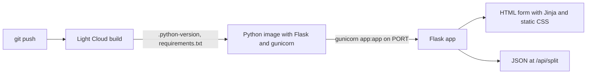

# tutorial-flask-app

A small Flask app ("Split the bill") used in the Light Cloud tutorial
[A Flask app in production, without writing a Dockerfile](https://blog.light-cloud.com/tutorials/deploy-a-flask-app).



## Run it

```sh
python3 -m venv .venv
. .venv/bin/activate
pip install -r requirements.txt
flask --app app run --port 8000
```

`CURRENCY` sets the currency code shown after amounts (default `USD`).
